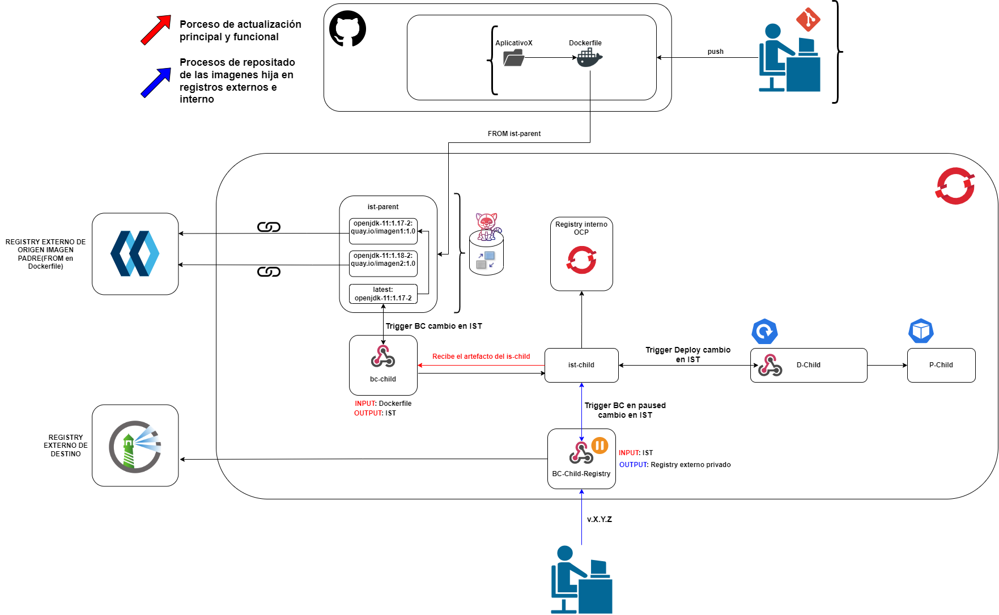

# Proyecto de CI/CD con OpenShift Container Platform (OCP)

Este repositorio está configurado para integrarse con un clúster de OpenShift Container Platform (OCP) utilizando WebHooks de acción push. Esto permite automatizar el proceso de despliegue y actualización de aplicaciones en tu clúster OCP cada vez que realizas un push a este repositorio.

## Descripción de la Arquitectura

La imagen a continuación representa un flujo de trabajo automatizado de CI/CD (Integración Continua y Despliegue Continuo) para el despliegue de aplicaciones usando OpenShift Container Platform (OCP).

### Desglose de la Arquitectura

#### 1. Repositorio y Aplicativo
- **Repositorio (GitHub)**: El repositorio contiene el código fuente del AplicativoX junto con un Dockerfile.
- **Acciones en el Repositorio**: Los desarrolladores realizan cambios en el código fuente y hacen push de estos cambios al repositorio.

#### 2. Integración Continua (CI)
- **BuildConfig (BC) del Proyecto Padre (ist-parent)**:
  - `openjdk:11.1.17-2` y `openjdk:11.1.18-2` son las imágenes base en el registry de Quay.io.
  - La actualización de estas imágenes desencadena la configuración del BuildConfig (bc-child).

#### 3. Desencadenamiento de BuildConfig e ImageStreams
- **BuildConfig (bc-child)**:
  - Recibe un Dockerfile como input y genera una ImageStreamTag (IST) como output.
  - **Trigger del BC (bc-child)**: Este trigger se activa cuando hay un cambio en el ImageStreamTag (ist-child).
- **ImageStreamTag (ist-child)**:
  - Al actualizarse esta imagen, se activa un despliegue controlado en OCP.

#### 4. Despliegue en OpenShift Container Platform (OCP)
- **Registry Interno OCP**: Las imágenes se almacenan en el registro interno de OCP.
- **Despliegue del Contenedor (D-Child)**: Este componente despliega la aplicación usando la imagen desde el ImageStreamTag (ist-child).
- **Despliegue en Producción (P-Child)**: Finalmente, la imagen se despliega en el entorno de producción de manera automatizada y controlada.

#### 5. WebHooks y Automatización
- **WebHook de Acción Push**:
  - Configurado en el repositorio para que cualquier push desencadene automáticamente la acción de despliegue.
- **Flujo de Automatización**:
  - Los desarrolladores hacen push en el repositorio.
  - El WebHook detecta el push y desencadena el BuildConfig (bc-child).
  - La nueva imagen se crea y se guarda en el registro interno de OCP.
  - Los cambios en la imagen activan el despliegue en el entorno de desarrollo (D-Child) y luego en producción (P-Child).

#### 6. Componentes de la Imagen
- **Componentes de Herramientas y Servicios**:
  - GitHub: Repositorio de código fuente.
  - Quay.io: Registro de contenedores.
  - OCP: Plataforma de contenedores.
  - Jenkins: Representado para tareas de CI/CD.
  - Iconos de despliegue y producción: Representan los diferentes entornos donde se despliega la aplicación.

### Flujo Resumido
1. **Push de Código**: Los desarrolladores realizan un push en GitHub.
2. **WebHook Activado**: El WebHook configura el BuildConfig (bc-child) en OCP.
3. **Generación de Imagen**: Se genera una nueva imagen y se guarda en el registro interno de OCP.
4. **Despliegue Automatizado y Controlado**: El cambio en la imagen desencadena el despliegue en el entorno de desarrollo (D-Child) y luego en producción (P-Child), de manera controlada.

